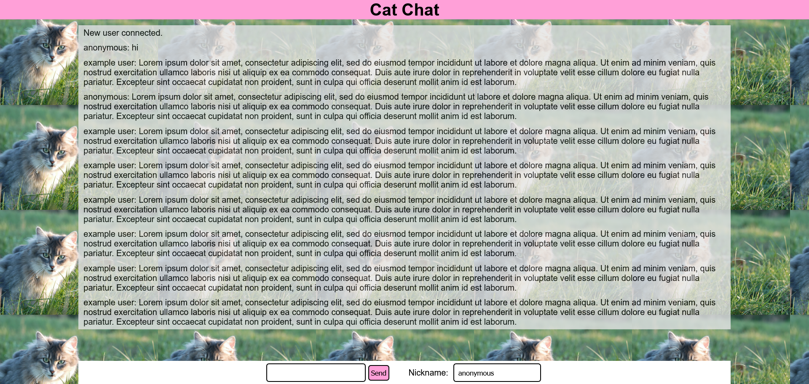

# Cat Chat
A messenger website themed around cats and built using [socket.io](https://github.com/socketio/socket.io) and [Express.js](https://github.com/expressjs/express). It uses https://api.sefinek.net/ for the random cat images shown in the background.

## Use
To use the messenger, you need to self-host it. First, download the repository. Then, navigate to the directory that contains package.json and type `npm install`. Finally, navigate to the `server` directory, make you have [node.js](https://nodejs.org/en) installed, and then run `node .` or `node index.js`. The website should now be available on http://localhost:3000/. If you want, you can download and use something like [TryCloudflare](https://developers.cloudflare.com/cloudflare-one/connections/connect-networks/do-more-with-tunnels/trycloudflare/) to generate a free temporary url so that others can use it with you.

## Known Bugs
- Sometimes, a nickname doesn't get set when you connect